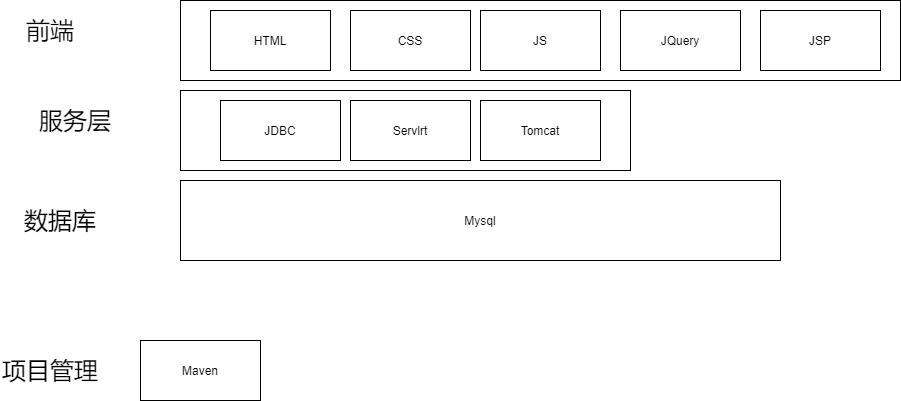
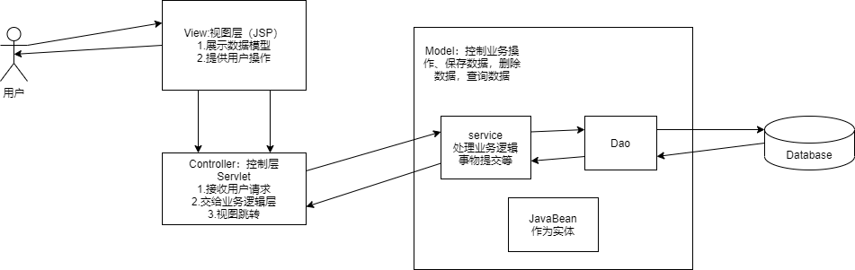
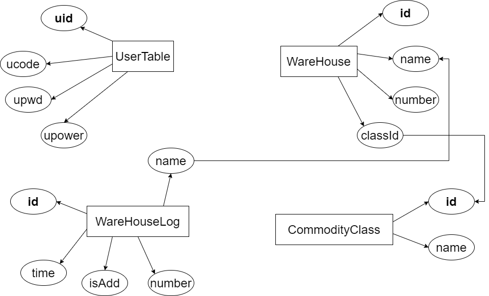
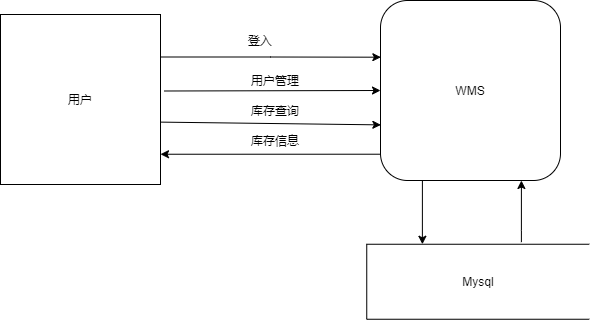
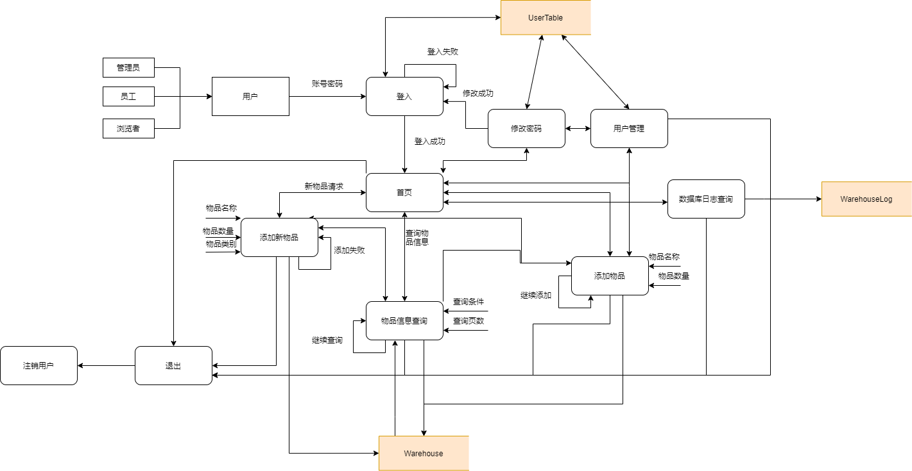
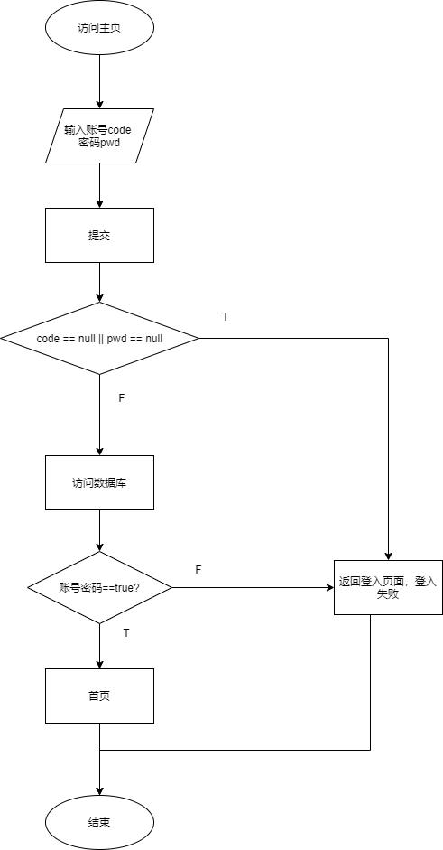
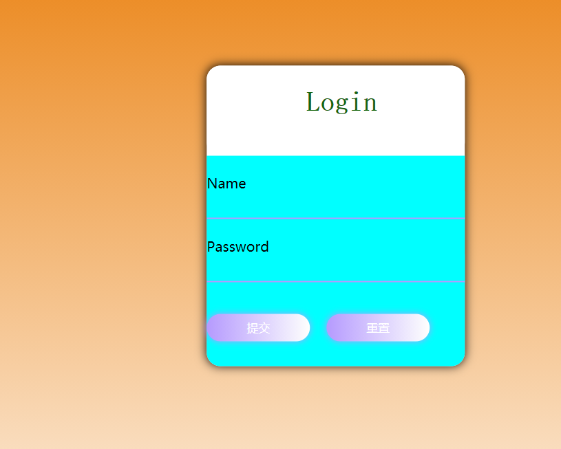
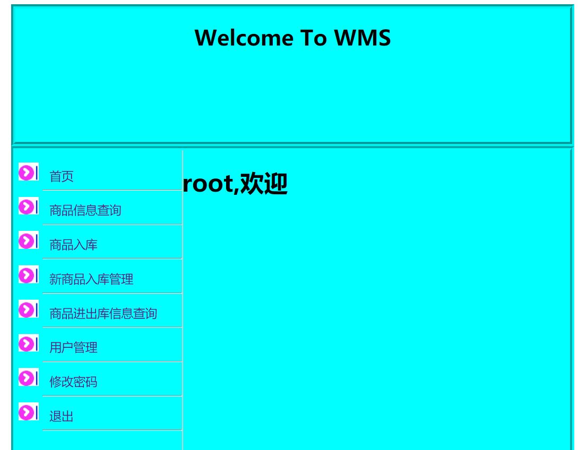
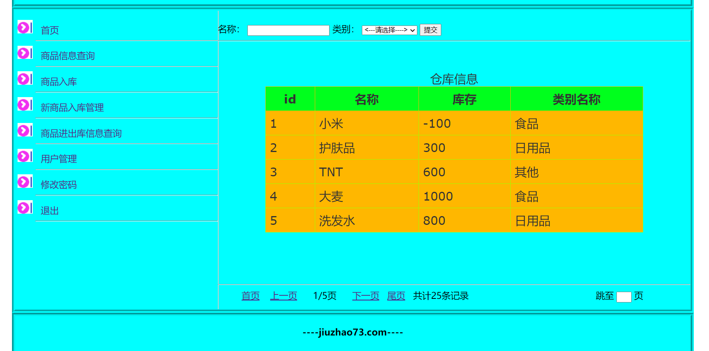
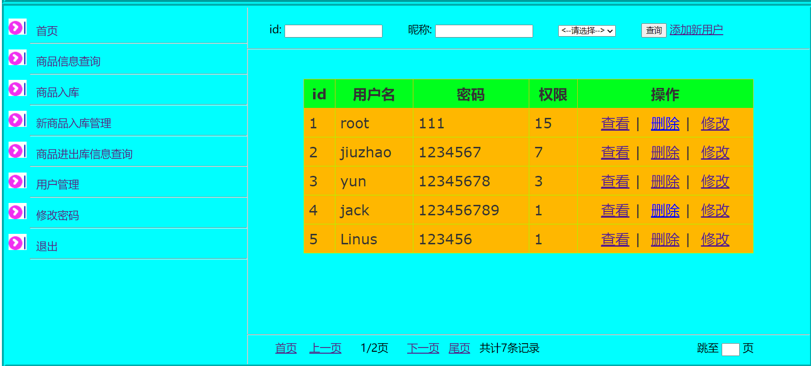

# WMS(仓库管理系统)

## 1、介绍

基于JSP的仓库管理系统，UI做的可能有些许丑QAQ，主要还是看功能的实现哈。

## 2、运行环境

ide使用的是:idea2020.1.1

tomcat9+maven3.6.3+jdk14+mysql8.0

## 3、架构

​	本项目采用MVC设计模式。

​	view视图层主要给用户展示数据、提供用户操作、以及访问控制层。在该层，主要使用html+css+js+jquery+JSP实现。

​	Controller控制层，主要用于接收用户请求、传递给业务逻辑层、视图间的请求转发与重定向。

​	Model层主要控制业务操作、保存数据、删除数据、查询数据等。在Model分为三个主要部位：Service、Dao、JavaBean。

​	Service层，在该层进行数据库事务提交、处理业务逻辑等。

​	Dao层进行数据库链接、crud。

​	JavaBean是实体，例如User用户类等。

## 4、数据库设计

本系统数据库由四个表构成，userTable存放登入用户数据，warehouse存放物品，warehouseLog存放物品存放日志，commodityClass存放类别信息。

在userTable表中，全能使用数字表示。如下图所示：

| 权值 | 能力 | 字母缩写 | 二进制码 |
| ---- | ---- | -------- | -------- |
| 1    | 查   | r        | 1        |
| 2    | 增   | c        | 10       |
| 4    | 改   | u        | 100      |
| 8    | 删   | d        | 1000     |

类似Linux的文件权限。

管理者拥有所有权值：1+2+4+8=15

员工拥有：1<power<15

浏览者只有阅读的权力：1

## 5、功能介绍

WMS顶层流程图：

第二层数据流图：

登入：

登入成功后，服务器将把用户User打包放入Session中，在用户访问/sys/*目录下资源时，过滤掉没有登入的用户。在用户对数据库进行增删改查时，服务器根据User的power进行判断是否有这个权限。

## 6、运行截图

登入页面：

首页：

商品信息查询：

用户管理界面：

等等...

## 7、测试

## 8、联系方式

QQ:2636211752

Email:www.2636211752@qq.com

